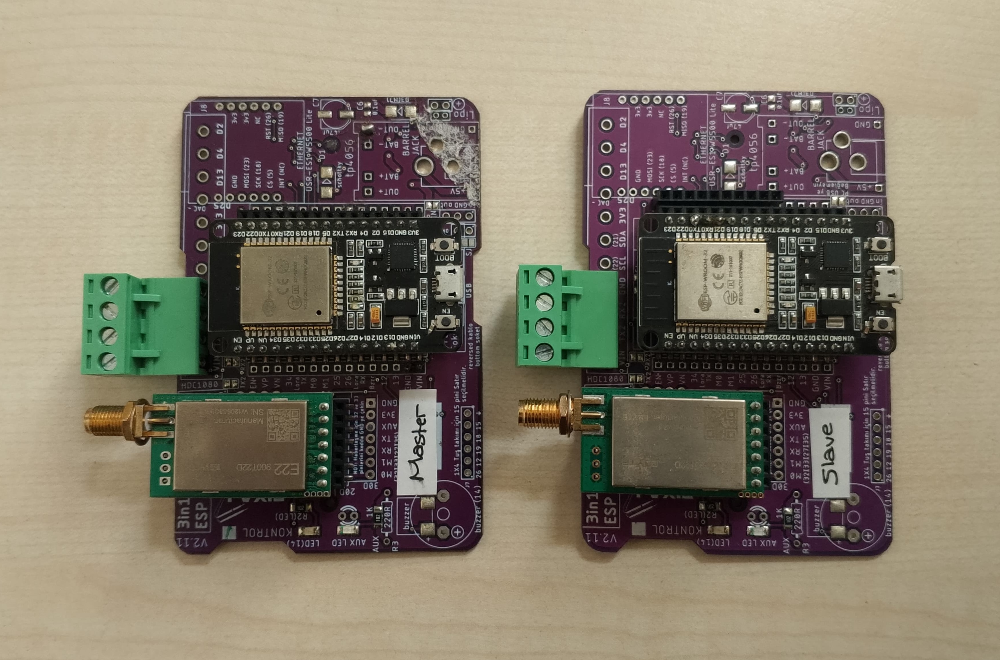

## 📶 `LoRa EBYTE E22900T22D Transceiver`

<br>

<div align="center">
<h3>⚡LoRa Shield </h3>

<h3>⚡Shield Guide</h3>

</div>
<h3>⚡Output</h3>

</div>

<br>
<br>

- ✅ LoRa Transceiver Messaging

<br>

Used Technologies in The Project:

[](https://www.espressif.com/en/products/socs/esp32)
[](https://mosquitto.org/)
[](https://www.cdebyte.com/products/E22-230T22D)
[](https://fixaj.com/3in1-esp-pcb/)

<br>

> Docker Mosquitto [Usage](https://github.com/furkankayam/mqtt-broker-allow-anonymous)

<br>

##### ⚙️ WiFi and MQTT Settings

```ino
const char* WiFi_SSID = "<WIFI_NAME>";
const char* WiFi_PASS = "<WIFI_PASSWORD>";
const char* MQTT_SERVER = "<MQTT_SERVER_IP>";
```

<br>

# License

This project is licensed under the MIT License. See the [LICENSE](LICENSE) file for details
